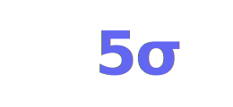

---
hide:
  - navigation
  - toc
---

# 

  
  
Divulgación de IA sin hype

---
### ¿Qué es "5sigmas"?
Es un proyecto que nace de la curiosidad que sentimos al ver cómo la IA se ha convertido en un fenómeno de masas, algo incluso afectando a la cultura popular. Esta tecnología es capaz de ayudarnos a resolver los verdaderos problemas de la humanidad, desde la energía, salud, agricultura y hasta la educación.

Pero no viene de gratis, acarrean la proliferación de los llamados "gurús". 
Los que son expertos en ChatGPT (incluso desde el 2012...), los que lo ven venir todo y cuando se equivocan simplemente borran el historial...

Además, la generación de contenido puramente generado por IA hace más necesario que nunca que simplifiquemos los mensajes, que comuniquemos la esencia de la información.

### ¿Por qué "5sigmas"?
En física, un descubrimiento se considera confirmado cuando alcanza una significancia estadística de **5 sigma** (probabilidad de error de 1 en 3.5 millones). 

Este proyecto busca esa misma rigurosidad: separar el *hype* del conocimiento fundamental, ofreciendo una perspectiva técnica y profunda sobre la inteligencia artificial.

## La Serie: De las cavernas a la AGI

Esta serie explora la evolución del pensamiento humano dividida en tres actos fundamentales. 
No es solo historia. Es el mapa para entender dónde estamos, cómo hemos llegado aquí y hacia dónde vamos.

-   :material-pencil: **Acto I: Inventar símbolos**
    
    Desde las primeras abstracciones matemáticas hasta la Revolución Científica. Cómo aprendimos a externalizar el pensamiento.
    
    [:arrow_right: Leer Acto I](series/from-cave-to-AGI/01-from-cave-to-logic.md)

-   :material-robot: **Acto II: Enseñar a las máquinas**
    
    La era de la computación mecánica y electrónica. De Ada Lovelace a Alan Turing y las primeras redes neuronales.
    
    [:arrow_right: Leer Acto II](series/from-cave-to-AGI/02-logic-to-computation.md)

-   :material-brain: **Acto III: Escalar el aprendizaje**
    
    El auge del Deep Learning, los LLMs y la búsqueda de la AGI. Entendiendo los límites físicos y energéticos.
    
    [:arrow_right: Leer Acto III](series/from-cave-to-AGI/03-control-to-learning.md)

  <small> 5sigmas - Divulgación de IA sin hype</small>

