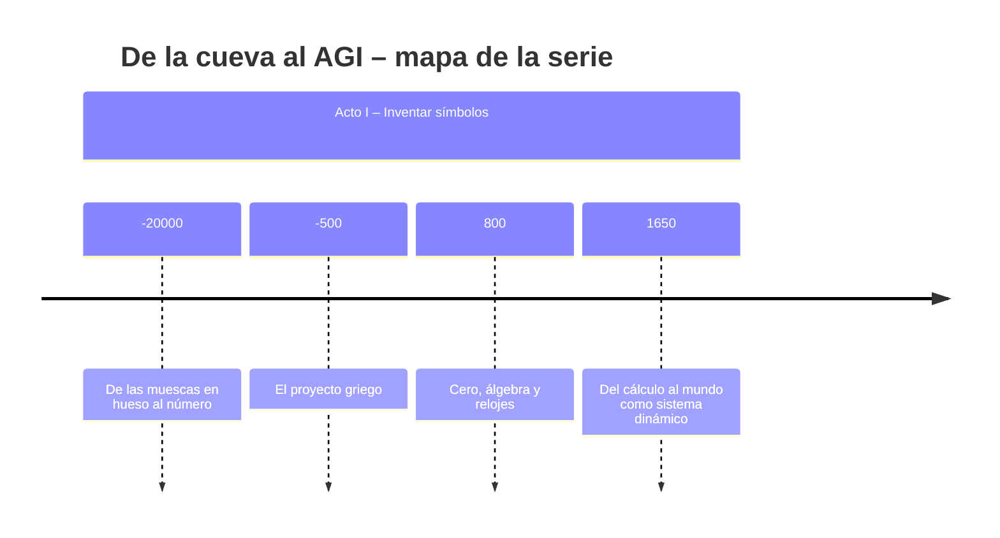
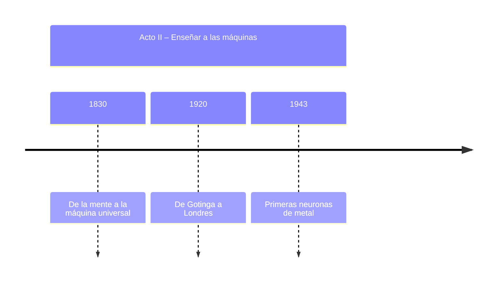
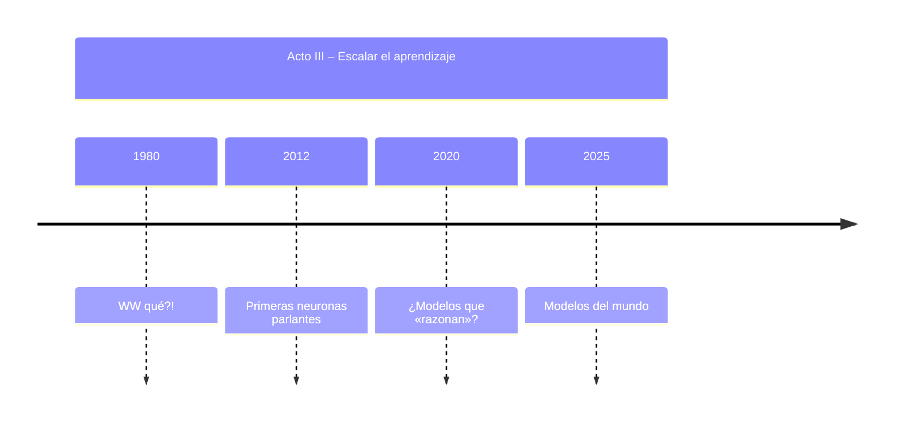

# De la cueva al AGI

Imagina una escena hace unos 20.000 años.

Alguien, en lo que hoy es el Congo, sostiene un pequeño hueso y va marcando muescas. No sabemos si cuenta días, presas o ciclos lunares, pero sí sabemos que esas marcas (el famoso hueso de Ishango) parecen estar agrupadas con una regularidad que sugiere más que simple decoración: hay estructura numérica, quizá incluso patrones en torno a múltiplos y primos.

No son matemáticas en el sentido moderno, pero sí es algo crucial: es un cerebro humano externalizando cantidad y patrón en un objeto.

Este es el primer gesto de una historia muy larga: la historia de cómo hemos ido sacando fuera de la cabeza el pensamiento, ya sea en forma de números, símbolos, máquinas... hasta llegar al punto en el que estamos hoy, con sistemas capaces de "razonar" en lenguaje natural y escribir código, gracias a datacenters que consumen la electricidad de pequeñas ciudades.

En esta serie trataremos de explicar cómo el ser humano construye sistemas que externalizan su capacidad de abstracción en artefactos acumulativos de conocimiento, que nos permiten reutilizar y ampliar lo que sabemos de forma exponencial.

En esta serie trataremos de ver cómo la famosa "AGI" o "Inteligencia Artificial General" o "la máquina que nos quita a todos de trabajar en general" no es más que una consecuencia de todos los desarrollos del pensamiento humano en filosofía, ciencia e ingeniería.

Cuando hablo de AGI me refiero a sistemas capaces de aprender y resolver muchos tipos de tareas distintas, de adaptarse rápidamente a nuevas tareas de forma flexible, sin que nadie los haya diseñado solo para esa cosa concreta. No es una calculadora gigante ni un simple chatbot: sería una inteligencia general capaz de moverse con soltura por problemas muy diferentes, de forma parecida a cómo lo hace una persona adulta media, aunque no piense ni sienta como nosotros. Y algo importante,  esa AGI aún no existe; lo que tenemos son modelos muy potentes pero centrados sobre todo en imitar lenguaje.

No es un salto cuántico, es un ladrillo más que surge como consecuencia de todo el conocimiento acumulado a lo largo de los milenios.

Como toda buena historia, necesitamos un protagonista. El nuestro es Kai, representante de la época que le toque: no tiene que impresionar a jefes ni vecinos, ni levantar pasta con la nueva empresa.AI que lo va "a cambiar todo".

Para ordenar todo esto vamos a dividir las publicaciones en tres actos:

## Acto I – Inventar símbolos (de la cueva a la Revolución Científica)

1. De las muescas en hueso al número: cómo nace la abstracción (< 1000 a. C.)
2. El proyecto griego (1000 a. C. – año 0)
3. Cero, álgebra y relojes (año 0 – 1500)
4. Del cálculo al mundo como sistema dinámico (1500–1800)

## Acto II – Enseñar a las máquinas (1800–1950)

1. De la mente a la máquina universal
2. De Gotinga a Londres
3. Primeras neuronas de metal

## Acto III – Escalar el aprendizaje (1980–2025)

1. WW qué?!
2. Primeras neuronas parlantes
3. ¿Modelos que «razonan»?
4. Modelos del mundo

Después de esta serie tendrás un tamiz mental con el que separar el grano de la paja: distinguir el hype del conocimiento base que realmente nos nutre y nos permite dar el siguiente paso.
La idea no es que salgas “experto en IA/AGI", sino que tengas un mapa claro desde la cueva hasta los datacenters actuales, para poder situar cualquier nuevo modelo, paper o producto dentro de esa historia y decidir por ti mismo cuánto tiene de humo y cuánto de ladrillo real.


```mermaid
flowchart TD
    %% Acto I
    subgraph Acto_I["Acto I – Inventar símbolos (de la cueva a la Revolución Científica)"]
        A1["-20000 – De las muescas en hueso al número"] --> A2["-500 – El proyecto griego"]
        A2 --> A3["800 – Cero, álgebra y relojes"]
        A3 --> A4["1650 – Del cálculo al mundo como sistema dinámico"]
    end

    %% Acto II
    subgraph Acto_II["Acto II – Enseñar a las máquinas (1800–1950)"]
        B1["1830 – De la mente a la máquina universal"] --> B2["1920 – De Gotinga a Londres"]
        B2 --> B3["1943 – Primeras neuronas de metal"]
    end

    %% Acto III
    subgraph Acto_III["Acto III – Escalar el aprendizaje (1980–2025)"]
        C1["1980 – WW qué?!"] --> C2["2012 – Primeras neuronas parlantes"]
        C2 --> C3["2020 – ¿Modelos que "razonan"?"]
        C3 --> C4["2025 – Modelos del mundo"]
    end

    %% Conexión entre actos
    A4 --> B1
    B3 --> C1
```




