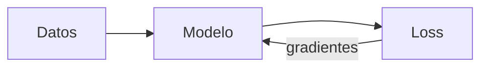
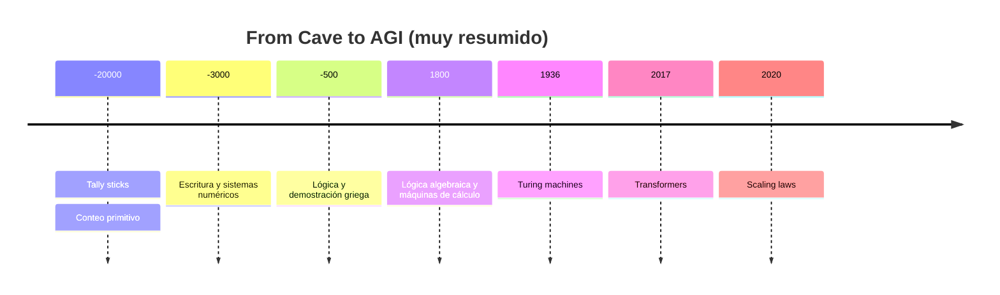
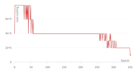

# Logic to computation

ssss

\[
\cos x = \sum_{k=0}^{\infty} \frac{(-1)^k}{(2k)!} x^{2k}
\]

El homomorfismo $f$ es inyectivo si y sólo si su núcleo es $\{e_G\}$.

```mermaid
flowchart LR
  A[Datos] --> B[Modelo]
  B --> C[Loss]
  C -->|gradientes| B
```

```mermaid
timeline
  title From Cave to AGI (muy resumido)
  -20000 : Tally sticks : Conteo primitivo
  -3000  : Escritura y sistemas numéricos
  -500   : Lógica y demostración griega
  1800   : Lógica algebraica y máquinas de cálculo
  1936   : Turing machines
  2017   : Transformers
  2020   : Scaling laws
```

